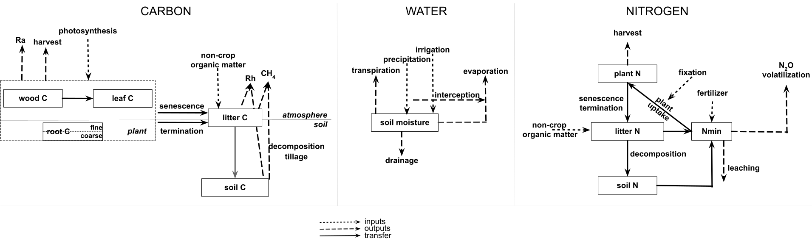

# SIPNET

SIPNET (Simplified Photosynthesis and Evapotranspiration Model) is a lightweight ecosystem model for coupled carbon, water, nitrogen, and trace greenhouse-gas (N₂O, CH₄) dynamics. It was built for data-assimilation workflows with eddy-covariance observations and now supports applications from forest carbon inventories to managed croplands. Recent development has focused on agricultural management and nitrogen cycling, and it is coupled to the [PEcAn Project](https://pecanproject.org/) modeling framework.

## Capabilities at a Glance

- Simulates photosynthesis, respiration, allocation, soil water, soil temperature, and nitrogen cycling <!--methane production--> on sub-daily time steps.
- Tracks a compact set of vegetation, litter, soil, and mineral-N pools, enabling fast single-site runs, ensembles, and Monte Carlo experiments.
- Assimilates high-frequency observations (eddy covariance, chamber fluxes, remote sensing) and works within PEcAn model calibration, assimilation, and analysis workflows.
- Event-based management handles planting, harvest, tillage, irrigation (including flooding), fertilization, and organic amendments.
- Nitrogen cycle includes plant, soil, and mineral N pools, with plant uptake, nitrogen limitation, mineralization, volatilization, and leaching.
- Model structure can be configured with a config file or command line options.
- Clean, modular, and thoroughly tested BSD-licensed codebase ready for both research workflows and production use.

## Where to Start

- **Getting started:** Follow the [quick-start guide](user-guide/getting-started.md) to install prerequisites, compile, and run smoke tests.
- **Running the model:** The [user guide](user-guide/running-sipnet.md) explains configuration, climate/parameter files, and runtime options, with dedicated pages for [inputs](user-guide/model-inputs.md) and [outputs](user-guide/model-outputs.md).
- **Understanding the code:** The [developer docs](model-structure.md) describe architecture, while sections on [testing](developer-guide/testing.md) and [CLI extensions](developer-guide/cli-options.md) cover contributions.
- **Project practices:** Review the [Contributing guide](CONTRIBUTING.md), [Code of Conduct](CODE_OF_CONDUCT.md), and [Changelog](CHANGELOG.md) before opening PRs or issues.

Need help? Open an issue on [GitHub](https://github.com/PecanProject/sipnet/issues) or join the [PEcAn community Slack](https://join.slack.com/t/pecanproject/shared_invite/zt-3ile31ylu-r1sMh~esl~7A_AolYNNYLQ).

## License

SIPNET is distributed under the BSD 3-Clause license—see [LICENSE](../LICENSE) for the full text.

## References & Releases

**Software**

- Longfritz, M., W. J. Sacks, D. J. P. Moore, J. M. Zobitz, B. H. Braswell, D. S. Schimel, R. Kooper, M. C. Dietze, I. Fer, C. Black, and D. S. LeBauer. 2025. *SIPNET: Simple Photosynthesis and Evapotranspiration Model (v2.0.0).* [https://doi.org/10.5281/zenodo.17148669](https://doi.org/10.5281/zenodo.17148669)

**Model foundations**

- Braswell, B. H., W. J. Sacks, E. Linder, and D. S. Schimel. 2005. *Global Change Biology* 11(2):335–355. https://doi.org/10.1111/j.1365-2486.2005.00897.x
- Moore, D. J. P., J. Hu, W. J. Sacks, D. S. Schimel, and R. K. Monson. 2008. *Agricultural and Forest Meteorology* 148(10):1467–1477. https://doi.org/10.1016/j.agrformet.2008.04.013
- Sacks, W. J., D. S. Schimel, and R. K. Monson. 2007. *Oecologia* 151(1):54–68. https://doi.org/10.1007/s00442-006-0565-2
- Sacks, W. J., D. S. Schimel, R. K. Monson, and B. H. Braswell. 2006. *Global Change Biology* 12(2):240–259. https://doi.org/10.1111/j.1365-2486.2005.01059.x
- Zobitz, J. M., D. J. P. Moore, T. Quaife, B. H. Braswell, A. Bergeson, J. A. Anthony, and R. K. Monson. 2014. *Agricultural and Forest Meteorology* 195–196:73–88. https://doi.org/10.1016/j.agrformet.2014.04.011
- Zobitz, J. M., D. J. P. Moore, W. J. Sacks, R. K. Monson, D. R. Bowling, and D. S. Schimel. 2008. *Ecosystems* 11(2):250–269. https://doi.org/10.1007/s10021-007-9120-1
- Zobitz, J., H. Aaltonen, X. Zhou, F. Berninger, J. Pumpanen, and K. Köster. 2021. *Geoscientific Model Development* 14(10):6605–6622. https://doi.org/10.5194/gmd-14-6605-2021

**SIPNET + PEcAn applications**

- Dokoohaki, H., B. D. Morrison, A. Raiho, S. P. Serbin, and M. Dietze. 2021. https://doi.org/10.5194/gmd-2021-236
- Dokoohaki, H., B. D. Morrison, A. Raiho, S. P. Serbin, K. Zarada, L. Dramko, and M. Dietze. 2022. *Geoscientific Model Development* 15:3233–3252. https://doi.org/10.5194/gmd-15-3233-2022
- Fer, I., R. Kelly, P. R. Moorcroft, A. D. Richardson, E. M. Cowdery, and M. C. Dietze. 2018. *Biogeosciences* 15:5801–5830. https://doi.org/10.5194/bg-15-5801-2018

**Key Releases**

- [v2.0.0 “Add Events and Refactor”](https://github.com/PecanProject/sipnet/releases/tag/v2.0.0): major refactor to add event system for managed ecosystems, modularize code, and improve build/test infrastructure.
- [v1.2.0 “fAPAR assimilation”](https://github.com/PecanProject/sipnet/releases/tag/v1.2.0): MODIS-derived fAPAR assimilation for joint NEE + remote sensing workflows (Zobitz 2014).
- [v1.1.0 “Roots and Microbes”](https://github.com/PecanProject/sipnet/releases/tag/v1.1.0): microbial soil respiration, root pools, and joint CO₂/H₂O assimilation (Moore 2008; Zobitz 2008).
- [v1.0.0 “First release”](https://github.com/PecanProject/sipnet/releases/tag/v1.0.0): baseline Braswell (2005) model with with improved hydrology, evergreen phenology (Sacks 2006), and respiration partitioning (Sacks 2007).
