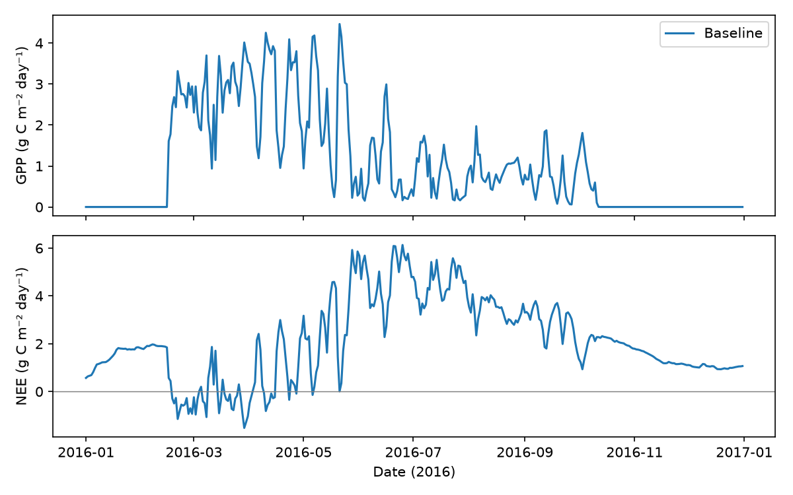
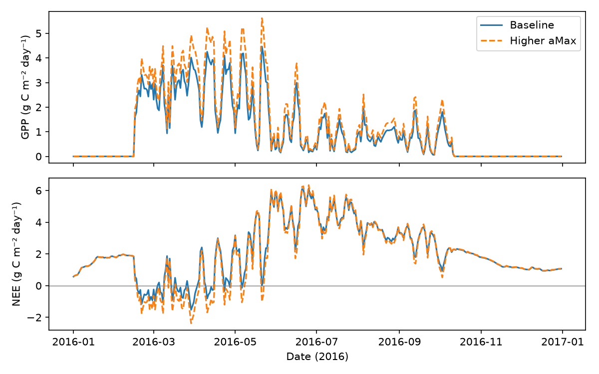

# Getting started with SIPNET: a Russell Ranch example


## 1. What is SIPNET?

SIPNET is the Simplified Photosynthesis and Evapotranspiration Model. It simulates the exchange of carbon, nitrogen, and water between the land surface and the atmosphere. It represents plant growth, soil biogeochemistry, and ecosystem management events. The user can supply weather, initial conditions, parameters, and settings; SIPNET calculates changes in ecosystem pools and fluxes through time.

This tutorial uses an example based on the [Century Experiment at Russell Ranch](https://asi.ucdavis.edu/programs/ce). It will walk you through running the model, changing a parameter, and comparing carbon uptake fluxes. Allow about 30 minutes after installation.

**Requirements:** basic terminal operations, Python 3.12 or newer, and SIPNET 2.2.0. The release binaries below support Apple Silicon macOS and x86-64 Linux, including WSL.

The table below lists other documentation topics that will help familiarize yourself with SIPNET.
| Topic | Reference |
|---|---|
| Processes, pools, and equations | [Model structure](../model-structure.md) |
| Weather, parameter, and management file formats | [Model inputs](model-inputs.md) |
| Parameter meanings and units | [Parameters](../parameters.md) |
| Configuration settings and command-line options | [Running SIPNET](running-sipnet.md) |
| Output variables and units | [Model outputs](model-outputs.md) |

**Parameters** describes the ecosystem and its processes, including plant physiological traits and soil biogeochemical kinetics.

**Settings** describes select model features and control files and outputs.

## 2. Run SIPNET

Download and unzip the [tutorial inputs](https://github.com/PecanProject/sipnet/releases/download/v2.2.0/sipnet-tutorial-v2.2.0.zip). This creates a `sipnet-tutorial` directory containing the Russell Ranch inputs and a ready-to-run configuration. All subsequent commands run there; no repository checkout or compiler is needed.

```bash
curl -fL https://github.com/PecanProject/sipnet/releases/download/v2.2.0/sipnet-tutorial-v2.2.0.zip -o sipnet-tutorial-v2.2.0.zip
unzip sipnet-tutorial-v2.2.0.zip
cd sipnet-tutorial
```

Download the [release binary](https://github.com/PecanProject/sipnet/releases/tag/v2.2.0). Set `platform=linux-x86_64` for Linux or WSL, or `platform=macos-arm64` for Apple Silicon:

```bash
platform=macos-arm64
curl -fL "https://github.com/PecanProject/sipnet/releases/download/v2.2.0/sipnet-${platform}-v2.2.0.tar.gz" -o sipnet.tar.gz
tar -xzf sipnet.tar.gz
./sipnet --version
```

The version should be `2.2.0`. Run the supplied example:

```bash
./sipnet -i sipnet.in
head -n 4 sipnet.out
```

| File | Contents |
|---|---|
| `sipnet.in` | Model settings and output options |
| `sipnet.clim` | Weather and timestep lengths |
| `sipnet.param` | Parameters and initial pool values |
| `events.in` | Irrigation schedule |

The supplied `russell_1` example covers 2016–2017 in three-hour timesteps. This configuration simulates carbon and water, with irrigation enabled and nitrogen cycling disabled. The run writes `sipnet.out` (time series), `events.out` (processed events), and `sipnet.config` (effective settings). Investigate any warnings or errors before using the results.

Save copies of the baseline parameters and outputs before changing anything. The `base.*` names are chosen for this tutorial; SIPNET writes `sipnet.out` and `events.out` again on each run.

```bash
cp sipnet.param base.param
cp sipnet.out base.out
cp events.out base.events.out
```

Prepare Python for plotting:

```bash
python3 -m venv .venv
source .venv/bin/activate
python -m pip install pandas matplotlib
```

From `sipnet-tutorial`, start the Python console:

```bash
python
```

Paste the code below at the `>>>` prompt. It reads named output columns and constructs dates from the year, day of year, and hour. The `read_daily` function selects 2016 and sums timestep GPP and NEE into daily totals.

```python
import pandas as pd
import matplotlib.pyplot as plt


def read_daily(filename):
    data = pd.read_csv(filename, sep=r"\s+")
    data.index = (pd.to_datetime(data.year.astype(str), format="%Y")
                  + pd.to_timedelta(data.day - 1, unit="D")
                  + pd.to_timedelta(data.time, unit="h"))
    return data.loc["2016", ["gpp", "nee"]].resample("D").sum()


baseline = read_daily("base.out")
fig, axes = plt.subplots(2, 1, figsize=(8, 5), sharex=True)
for axis, column in zip(axes, ["gpp", "nee"]):
    axis.plot(baseline.index, baseline[column], label="Baseline")
    axis.set_ylabel(f"{column.upper()} (g C m⁻² day⁻¹)")

axes[0].legend()
axes[1].axhline(0, color="gray", linewidth=0.7)
axes[1].set_xlabel("Date (2016)")
fig.tight_layout()
fig.savefig("baseline.png", dpi=150)
plt.show()
```

The plot opens in a window and is also saved as `baseline.png`. Close the plot window, then enter `exit()` at the Python prompt to return to the terminal before continuing. If no window opens, view the saved PNG.



*Baseline daily carbon fluxes at the supplied initial conditions.*

GPP is photosynthetic uptake; NEE is ecosystem respiration minus GPP. Negative NEE means net uptake. These outputs already include timestep length, so sum them without multiplying by three hours. Do not sum the running total `cumNEE`.

## 3. Change a parameter

`aMax` specifies maximum net CO₂ assimilation per unit leaf mass, in nmol CO₂ g⁻¹ leaf s⁻¹. In `sipnet.param`, replace:

```text
aMax 53.2895432752984
```

with a value 20% higher:

```text
aMax 63.94745193035808
```

Check the edit:

```bash
diff base.param sipnet.param
```

Only the `aMax` line should differ. The diff command's exit status of 1 means a difference was found, as expected.

## 4. Do an experiment

Predict: will 20% higher `aMax` increase GPP by exactly 20%? Will the ecosystem take up more carbon overall? Run again in the same directory; the baseline is preserved in `base.out`.

```bash
./sipnet -i sipnet.in
```

Start a fresh Python console with `python`, then paste this complete comparison example:

```python
import pandas as pd
import matplotlib.pyplot as plt


def read_daily(filename):
    data = pd.read_csv(filename, sep=r"\s+")
    data.index = (pd.to_datetime(data.year.astype(str), format="%Y")
                  + pd.to_timedelta(data.day - 1, unit="D")
                  + pd.to_timedelta(data.time, unit="h"))
    return data.loc["2016", ["gpp", "nee"]].resample("D").sum()


baseline = read_daily("base.out")
modified = read_daily("sipnet.out")
fig, axes = plt.subplots(2, 1, figsize=(8, 5), sharex=True)
for axis, column in zip(axes, ["gpp", "nee"]):
    axis.plot(baseline.index, baseline[column], label="Baseline")
    axis.plot(modified.index, modified[column], "--", label="Higher aMax")
    axis.set_ylabel(f"{column.upper()} (g C m⁻² day⁻¹)")

axes[0].legend()
axes[1].axhline(0, color="gray", linewidth=0.7)
axes[1].set_xlabel("Date (2016)")
fig.tight_layout()
fig.savefig("comparison.png", dpi=150)

totals = pd.DataFrame({"Baseline": baseline.sum(), "Higher aMax": modified.sum()})
totals["Difference"] = totals["Higher aMax"] - totals["Baseline"]
totals.to_csv("annual-totals.csv")
print(totals.round(2))
plt.show()
```

The code displays the comparison, saves `comparison.png`, and prints annual totals and absolute differences (higher `aMax` minus baseline) in g C m⁻², and saves them in `annual-totals.csv`. Compare their signs and magnitudes with your prediction. Close the plot window and enter `exit()` to return to the terminal.



*Daily fluxes under the same weather, irrigation, initial conditions, and settings. Only `aMax` changes.*

Higher `aMax` increases annual GPP and lowers annual NEE. Annual NEE remains positive in both runs, so both scenarios release more carbon than they take up over this year.

The response need not be proportional. `aMax` enters both photosynthesis and foliar respiration calculations. Potential photosynthesis also determines potential transpiration; water availability can limit realized uptake. Nitrogen limitation is disabled in this example. This is a sensitivity exercise starting from supplied initial pools; it does not establish site calibration or model accuracy.

For another experiment, choose a parameter from the reference table and test how its effect interacts with `aMax`, keeping the baseline unchanged. Optionally, continue to [Tutorial 2: the SIPNET viewer](tutorial-2.md) for interactive plots and irrigation overlays. The viewer is not required for this tutorial.

### Clean up

Keep the working directory if you plan to follow Tutorial 2. Otherwise, save any results you need elsewhere. To remove just the downloaded archives, run `rm sipnet.tar.gz ../sipnet-tutorial-v2.2.0.zip`. When finished, these commands remove the entire working directory, including its Python environment and results:

```bash
deactivate
cd ..
rm -r sipnet-tutorial
```
