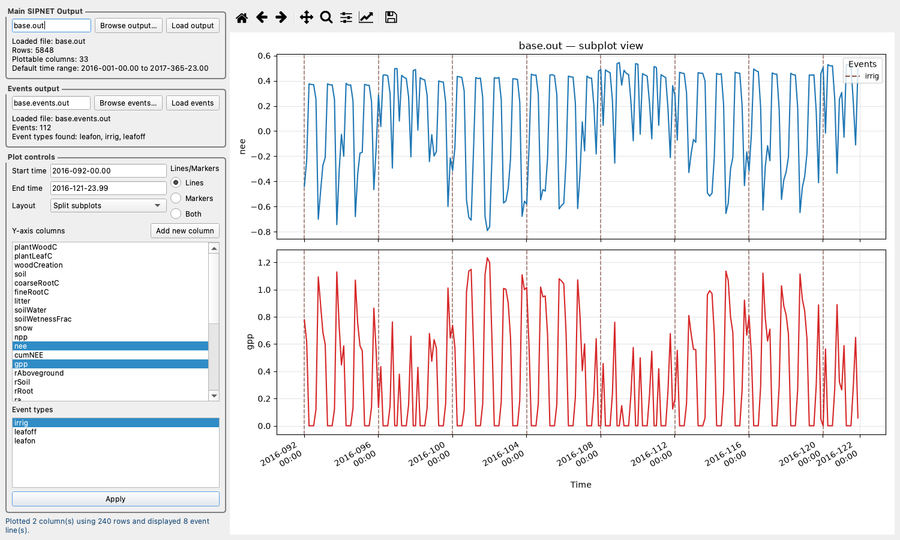

# Exploring output with the SIPNET viewer

The Python viewer opens SIPNET output files, plots selected variables, and overlays management events. This tutorial uses the runs from [Tutorial 1](tutorial-1.md). Its baseline-saving step copies `sipnet.out` to `base.out` and `events.out` to `base.events.out` before changing `aMax`. After the second run, `sipnet.out` and `events.out` contain the modified scenario. Keep that working directory until you finish.

## 1. Open the baseline

From your `sipnet-tutorial` directory, activate the Python environment and install the viewer from the v2.2.0 source release. This installs Python tools; it does not compile the model. A graphical desktop is required, including GUI support if using WSL.

```bash
source .venv/bin/activate
python -m pip install "https://github.com/PecanProject/sipnet/archive/refs/tags/v2.2.0.tar.gz"
sipnet-view --input-file base.out --events-file base.events.out
```

In **Y-axis columns**, click `gpp` and `nee` to select both; click any other selected variable to deselect it. Choose **Split subplots**, set **Start time** to `2016-092-00.00` and **End time** to `2016-121-23.99`, then click **Apply**. This selects April 2016, using year–day-of-year–hour notation.

The viewer shows native three-hour timestep totals in g C m⁻², whereas Tutorial 1 plots daily sums. Negative NEE means net uptake. Use the plot toolbar to zoom or pan, and its home button to restore the plotted extent.

## 2. Show irrigation events

Select `irrig` under **Event types**, then click **Apply**. Vertical lines mark irrigation events from `base.events.out`. Changes to columns, dates, or events take effect when you click **Apply**.



*Baseline output with irrigation events.*

The same view can be opened with preset selections:

```bash
sipnet-view --input-file base.out --events-file base.events.out \
  --columns gpp,nee --layout subplots --event-types irrig \
  --time-range 2016-092-00.00,2016-121-23.99
```

Click **Apply** to draw it. To explore another output, change **Y-axis columns**; use [Model outputs](model-outputs.md) for its definition and units.

## 3. Compare with the parameter experiment

Keep the baseline window open. In a second terminal, return to `sipnet-tutorial`, activate `.venv`, and open the modified output with matching selections:

```bash
source .venv/bin/activate
sipnet-view --input-file sipnet.out --events-file events.out \
  --columns gpp,nee --layout subplots --event-types irrig \
  --time-range 2016-092-00.00,2016-121-23.99
```

Click **Apply**. Compare the same dates and read the axis limits: each window autoscales independently. Use Tutorial 1's Python examples for overlaid daily curves and annual totals. Close both windows before following its [cleanup instructions](tutorial-1.md#clean-up).
