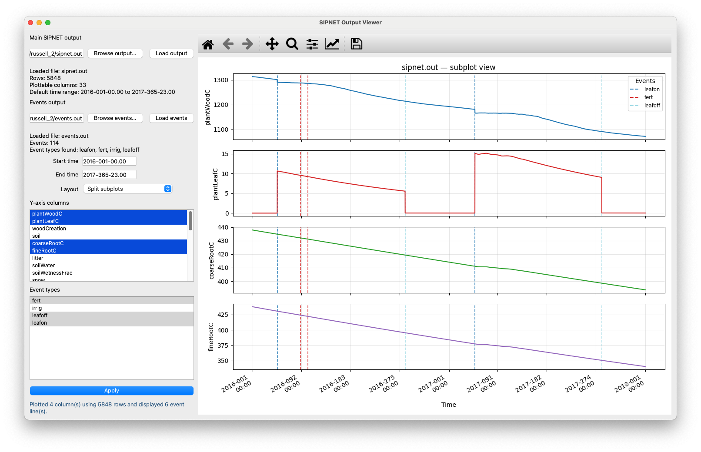

# SIPNET Output Viewer

Interactive viewer for `sipnet.out` files, with optional overlays from `events.out`.

Screenshot:


## Features and Requirements

- Loads `sipnet.out` by default, or a file passed on the command line
- Dynamically reads output headers from the file
  - Requires a main-output header row beginning with `year day time`
- Uses `year`, `day`, and `time` to build the x-axis
- Plots data columns as requested by the user from the y-axis column selector
  - Excludes `year`, `day`, and `time` from y-axis selections
- Loads `events.out` from the same directory by default when present
- Lets you browse and load a different events file
- Reads event rows from the first three columns: `year`, `day`, `type`
  - Ignores variable delta column
- Lets you choose which event types to display
- Draws dotted vertical event lines color-coded by event type
- Supports:
  - combined view with twinned y-axes
  - split subplot view
- Does not redraw on every selection change; redraw happens only when `Apply` is clicked
- Defaults the GUI time range to the full file
- Can pre-populate selected columns, event types, and time range from CLI options

## Install

See the install steps in the main [tools/README.md](README.md#install).

## Run Examples

From the repository root:
```zsh
sipnet-view
```
Open a specific file:
```zsh
sipnet-view --input-file tests/smoke/russell_1/sipnet.out
```

Open a specific output file and a custom events file:
```zsh
sipnet-view \
  --input-file tests/smoke/russell_1/sipnet.out \
  --events-file tests/smoke/russell_1/events.out
```

Pre-populate columns:
```zsh
sipnet-view --input-file tests/smoke/russell_1/sipnet.out --columns "gpp, npp, ra"
```

Pre-populate event types:
```zsh
sipnet-view \
--input-file tests/smoke/russell_1/sipnet.out \
--event-types leafon,irrig
```

Pre-populate time range:
```zsh
sipnet-view \
  --input-file tests/smoke/russell_1/sipnet.out \
  --time-range 2016-001-00.00,2016-010-12.00
```

Use subplot mode:
```zsh
sipnet-view \
  --input-file tests/smoke/russell_1/sipnet.out \
  --columns plantWoodC,soil,nee \
  --layout subplots
```

To see all options:
```zsh
sipnet-view --help
```

Notes
* If the main output file has no header row, the tool exits with an error.
* Leading note lines before the main output header are allowed.
* If the events file is missing, the viewer still works for sipnet.out.
* Event-type selections default to off.
* Empty Apply shows an inline status message and leaves the current plot unchanged.
* Invalid --time-range, unknown --columns, or unknown --event-types fail fast before the GUI opens.

Quick Test:
```zsh
python3 tools/test_sipnet-view.py
```
