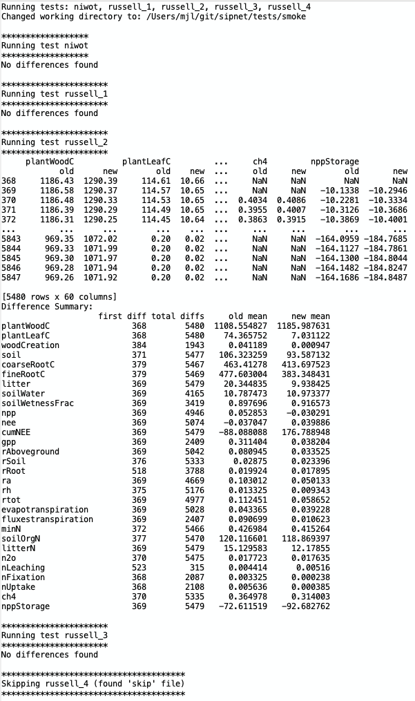

## Smoke Test Output Comparison Tool

This tool compares the output of a smoke test run to the expected output, reporting any differences. 

## Usage

List available tests to compare:
```zsh
smoke-check list
```

Run a summary comparison for all tests:
```zsh
smoke-check run
```
The summary comparison reports which tests had differences, but does not show the specific differences. This is useful
for a quick check across all tests.

Run a detailed comparison for a specific test:
```zsh
smoke-check run verbose <test-name>
```
The detailed comparison shows the specific differences in `sipnet.out` for the specified test. This is useful for
investigating the cause of differences in a specific test.

## Example Output

Example output from running `smoke-check run verbose` on all tests when nitrogen limitation was added. Only `russell_2`
had any differences, as that is the only test with the nitrogen cycle enabled. The output shows the specific
differences in `events.out` and `sipnet.out` for that test. Note that `russell_4` is not included in the output because
it had been disabled due to removal of microbes support at this time.

 

## More Info

To see all options for the `smoke-check` tool:
```zsh
smoke-check help
```
